# Fantasy Seers database ERD

This is the effective PostgreSQL schema after Flyway migrations V1 through V22. It intentionally excludes the tables and columns removed by later migrations.

```mermaid
erDiagram
    users {
        BIGINT id PK "BIGSERIAL"
        VARCHAR username UK "50, NOT NULL"
        VARCHAR email UK "255, NOT NULL"
        VARCHAR password "255, NOT NULL"
        INTEGER point_bank "NOT NULL, default 1000"
        VARCHAR role "20, NOT NULL, default USER"
        TIMESTAMP created_at "NOT NULL, default now"
        TIMESTAMP updated_at "NOT NULL, default now"
        VARCHAR favorite_nfl_team "50, nullable"
        VARCHAR favorite_nba_team "50, nullable"
        VARCHAR alma_mater "100, nullable"
        VARCHAR scoring_format "20, nullable"
        VARCHAR primary_format "20, nullable"
        BOOLEAN superflex "NOT NULL, default false"
        VARCHAR account_type "30, NOT NULL, default HUMAN"
    }

    friend_groups {
        BIGINT id PK "BIGSERIAL"
        VARCHAR name "100, NOT NULL"
        VARCHAR invite_code UK "20, NOT NULL"
        BIGINT owner_id FK "NOT NULL"
        TIMESTAMP created_at "NOT NULL, default now"
        INTEGER max_members "nullable"
    }

    friend_group_members {
        BIGINT group_id PK, FK "NOT NULL, ON DELETE CASCADE"
        BIGINT user_id PK, FK "NOT NULL, ON DELETE CASCADE"
        TIMESTAMP joined_at "NOT NULL, default now"
    }

    follows {
        BIGINT follower_id PK, FK "NOT NULL, ON DELETE CASCADE"
        BIGINT following_id PK, FK "NOT NULL, ON DELETE CASCADE"
        TIMESTAMP created_at "NOT NULL, default now"
    }

    props {
        BIGINT id PK "BIGSERIAL"
        VARCHAR title "255, NOT NULL"
        TEXT description "nullable"
        VARCHAR sport "20, NOT NULL"
        BIGINT created_by FK "NOT NULL"
        BOOLEAN is_admin_prop "NOT NULL, default false"
        VARCHAR scope "20, NOT NULL, default GROUP"
        VARCHAR status "20, NOT NULL, default OPEN"
        VARCHAR result "10, nullable"
        TIMESTAMP closes_at "NOT NULL"
        TIMESTAMP resolved_at "nullable"
        TIMESTAMP created_at "NOT NULL, default now"
        INTEGER min_wager "nullable"
        INTEGER max_wager "nullable"
    }

    prop_groups {
        BIGINT prop_id PK, FK "NOT NULL, ON DELETE CASCADE"
        BIGINT group_id PK, FK "NOT NULL, ON DELETE CASCADE"
    }

    votes {
        BIGINT id PK "BIGSERIAL"
        BIGINT prop_id FK "NOT NULL"
        BIGINT user_id FK "NOT NULL"
        VARCHAR choice "5, NOT NULL"
        INTEGER wager_amount "NOT NULL, greater than 0"
        INTEGER payout "nullable"
        TIMESTAMP created_at "NOT NULL, default now"
    }

    point_transactions {
        BIGINT id PK "BIGSERIAL"
        BIGINT user_id FK "NOT NULL"
        INTEGER amount "NOT NULL"
        VARCHAR type "30, NOT NULL"
        BIGINT reference_id "nullable, no FK constraint"
        TEXT note "nullable"
        TIMESTAMP created_at "NOT NULL, default now"
    }

    group_invites {
        BIGINT id PK "BIGSERIAL"
        BIGINT group_id FK "NOT NULL, ON DELETE CASCADE"
        BIGINT inviter_id FK "NOT NULL, ON DELETE CASCADE"
        BIGINT invitee_id FK "NOT NULL, ON DELETE CASCADE"
        VARCHAR status "20, NOT NULL, default PENDING"
        TIMESTAMP created_at "NOT NULL, default now"
        TIMESTAMP updated_at "NOT NULL, default now"
    }

    nfl_players {
        BIGINT id PK "BIGSERIAL"
        VARCHAR sleeper_id UK "50, NOT NULL"
        VARCHAR full_name "150, NOT NULL"
        VARCHAR position "10, NOT NULL"
        VARCHAR nfl_team "10, nullable"
        VARCHAR status "30, nullable"
        TIMESTAMP updated_at "nullable, default now"
        INTEGER adp "nullable"
        BOOLEAN active "NOT NULL, default false"
    }

    user_rankings {
        BIGINT id PK "BIGSERIAL"
        BIGINT user_id FK "NOT NULL, ON DELETE CASCADE"
        BIGINT player_id FK "NOT NULL, ON DELETE CASCADE"
        INTEGER overall_rank "NOT NULL"
        INTEGER positional_rank "NOT NULL"
        TIMESTAMP updated_at "nullable, default now"
    }

    consensus_rankings {
        BIGINT id PK "BIGSERIAL"
        BIGINT player_id FK, UK "NOT NULL, ON DELETE CASCADE"
        INTEGER overall_rank "NOT NULL"
        INTEGER positional_rank "NOT NULL"
    }

    board_snapshots {
        BIGINT id PK "BIGSERIAL"
        BIGINT user_id FK "NOT NULL"
        INTEGER season "NOT NULL"
        VARCHAR snapshot_type "20, NOT NULL, default PRESEASON"
        TIMESTAMPTZ created_at "NOT NULL, default now"
        VARCHAR scoring_format "20, NOT NULL, default FULL_PPR"
        BOOLEAN superflex "NOT NULL, default false"
        TIMESTAMPTZ locked_at "nullable"
    }

    snapshot_entries {
        BIGINT id PK "BIGSERIAL"
        BIGINT snapshot_id FK "NOT NULL, ON DELETE CASCADE"
        BIGINT player_id FK "NOT NULL"
        INTEGER user_rank "NOT NULL"
        TIMESTAMPTZ created_at "NOT NULL, default now"
    }

    adp_snapshots {
        BIGINT id PK "BIGSERIAL"
        BIGINT player_id FK "NOT NULL, ON DELETE CASCADE"
        VARCHAR source "30, NOT NULL"
        TIMESTAMPTZ captured_at "NOT NULL"
        INTEGER value "NOT NULL"
    }

    users ||--o{ friend_groups : owns
    users ||--o{ friend_group_members : joins
    friend_groups ||--o{ friend_group_members : contains
    users ||--o{ follows : follower
    users ||--o{ follows : following
    users ||--o{ props : creates
    props ||--o{ prop_groups : scoped_to
    friend_groups ||--o{ prop_groups : receives
    props ||--o{ votes : receives
    users ||--o{ votes : casts
    users ||--o{ point_transactions : has
    friend_groups ||--o{ group_invites : has
    users ||--o{ group_invites : sends
    users ||--o{ group_invites : receives
    users ||--o{ user_rankings : owns
    nfl_players ||--o{ user_rankings : ranked_in
    nfl_players ||--o| consensus_rankings : has
    users ||--o{ board_snapshots : owns
    board_snapshots ||--o{ snapshot_entries : contains
    nfl_players ||--o{ snapshot_entries : captured_in
    nfl_players ||--o{ adp_snapshots : observed_in
```

## Composite and unique constraints

- `friend_group_members`: primary key (`group_id`, `user_id`).
- `prop_groups`: primary key (`prop_id`, `group_id`).
- `follows`: primary key (`follower_id`, `following_id`) and `follower_id <> following_id`.
- `votes`: unique (`prop_id`, `user_id`).
- `group_invites`: unique (`group_id`, `invitee_id`).
- `user_rankings`: unique (`user_id`, `player_id`).
- `board_snapshots`: unique (`user_id`, `season`, `snapshot_type`).
- `snapshot_entries`: unique (`snapshot_id`, `player_id`) and (`snapshot_id`, `user_rank`).
- `adp_snapshots`: unique (`player_id`, `source`, `captured_at`).
- `users.account_type`: one of `HUMAN`, `CONSENSUS_BASELINE`, or `ADP_BASELINE`; non-human account types are individually unique.

## Migration history reflected here

- V5 removed `badges`, `user_badges`, and `users.is_public`.
- V6 removed `props.game_id`, `stat_key`, `stat_threshold`, and `stat_direction`.
- V9 removed `prop_submissions`.
- V21 changed `adp_snapshots.captured_at` from `TIMESTAMP` to `TIMESTAMPTZ` using UTC.
- `point_transactions.reference_id` is an application-level reference, not a database foreign key.
